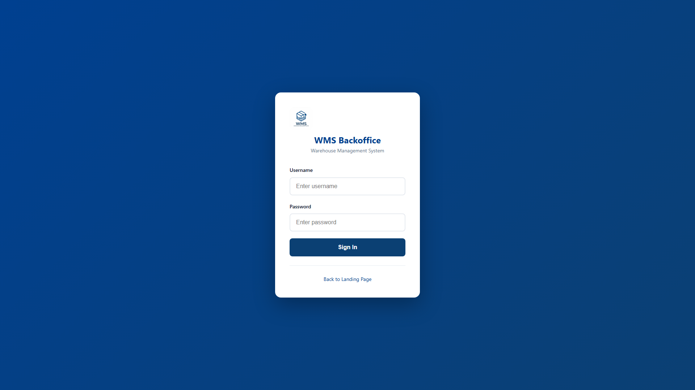

# WMS - Warehouse Management System

A production-ready **Warehouse Management System** built with Java 17, Spring Boot 3, and PostgreSQL. Features a complete order-to-shipment workflow with web backoffice, mobile handheld interface, and ZPL label printing.



## ✨ Features

- **Order Management** — Create, track, and manage customer orders through the complete lifecycle
- **Wave Picking** — Organize picks into waves for efficient warehouse operations
- **Handheld Packing** — Mobile-optimized interface for scanning and packing operations
- **Tote Tracking** — Real-time tote status and location management
- **Shipment & Labels** — Automatic ZPL label generation with carrier integration
- **User Management** — Role-based access control (Admin, Manager, Picker, Packer)
- **RESTful API** — Full Swagger/OpenAPI documentation

## 🏗️ Tech Stack

| Layer | Technology |
|-------|------------|
| **Backend** | Java 17, Spring Boot 3.2, Spring Security, Spring Data JPA |
| **Database** | PostgreSQL 16, Flyway migrations |
| **Auth** | JWT tokens with role-based access |
| **Frontend** | Vanilla HTML/CSS/JavaScript (no framework) |
| **Deploy** | Docker Compose, Nginx reverse proxy |
| **Docs** | Swagger UI (OpenAPI 3) |

## 📐 Architecture

```
┌─────────────────────────────────────────────────────────────────────┐
│                        WMS ARCHITECTURE                             │
├─────────────────────────────────────────────────────────────────────┤
│                                                                     │
│   ┌──────────┐    ┌──────────┐    ┌──────────┐    ┌──────────┐     │
│   │ FRONTEND │    │  NGINX   │    │ BACKEND  │    │POSTGRESQL│     │
│   │ Backoffice│───▶│  Proxy   │───▶│Spring Boot│───▶│   DB     │     │
│   │ Handheld │    │  :80     │    │  :8080   │    │  :5432   │     │
│   └──────────┘    └──────────┘    └──────────┘    └──────────┘     │
│                                                                     │
└─────────────────────────────────────────────────────────────────────┘
```

### Order Flow

```
  ┌─────────┐     ┌──────────┐     ┌─────────┐     ┌─────────┐     ┌─────────┐
  │  DRAFT  │────▶│ RELEASED │────▶│ PICKING │────▶│ PACKING │────▶│ SHIPPED │
  └─────────┘     └──────────┘     └─────────┘     └─────────┘     └─────────┘
```

## 📋 Requirements

- **Docker** & **Docker Compose** (recommended)
- Java 17+ (for local development without Docker)
- Node.js 18+ (for screenshot automation only)

## 🚀 Quick Start

### 1. Clone & Configure

```bash
git clone https://github.com/albertogalvez-dev/wms-warehouse-management.git
cd wms-warehouse-management

# Copy environment file
cp .env.example .env
```

### 2. Start Services

```bash
docker compose up -d
```

Wait ~60 seconds for all services to start.

### 3. Access the Application

| Service | URL |
|---------|-----|
| 🏠 Backoffice | http://localhost:8081/backoffice/ |
| 📱 Handheld | http://localhost:8081/handheld/ |
| 🌐 Landing | http://localhost:8081/landing/ |
| 📖 Swagger API | http://localhost:8081/swagger-ui/index.html |
| 💚 Health Check | http://localhost:8081/actuator/health |

### Default Credentials

| Username | Password | Role |
|----------|----------|------|
| `admin` | `admin123` | ADMIN |

## ⚙️ Environment Variables

| Variable | Description | Default |
|----------|-------------|---------|
| `DB_NAME` | Database name | `wms` |
| `DB_USER` | Database user | `wms` |
| `DB_PASS` | Database password | `wms` |
| `JWT_SECRET` | JWT signing key (32+ chars) | dev default |
| `JWT_EXPIRATION_MS` | Token expiration (ms) | `86400000` |
| `WMS_HTTP_PORT` | Nginx port binding | `8081` |
| `SPRING_PROFILES_ACTIVE` | Profile (dev/prod) | `dev` |

## 📜 Available Scripts

### Docker

```bash
# Start all services
docker compose up -d

# View logs
docker compose logs -f backend

# Stop services
docker compose down
```

### Screenshots

```bash
# Install dependencies (first time only)
npm install
npx playwright install chromium

# Generate screenshots
npm run screenshots
```

## 📸 Screenshots

All screenshots are stored in `@fotos/` folder:

| Screenshot | Description |
|------------|-------------|
| `@fotos/desktop/dashboard.png` | Main dashboard |
| `@fotos/desktop/orders.png` | Orders list |
| `@fotos/desktop/products.png` | Products catalog |
| `@fotos/desktop/waves.png` | Pick waves |
| `@fotos/desktop/totes.png` | Tote management |
| `@fotos/desktop/shipments.png` | Shipments |
| `@fotos/mobile/handheld-start.png` | Mobile packing |

### Regenerating Screenshots

```bash
# Ensure Docker services are running
docker compose up -d

# Set credentials (optional, defaults to admin/admin123)
export WMS_E2E_USER=admin
export WMS_E2E_PASS=admin123

# Run screenshot capture
npm run screenshots
```

Screenshots will be saved to `@fotos/desktop/` and `@fotos/mobile/` with a manifest at `@fotos/manifest.json`.

## 📡 API Overview

| Endpoint | Description |
|----------|-------------|
| `POST /auth/login` | Authenticate, returns JWT |
| `GET /api/products` | List products |
| `GET /api/orders` | List orders |
| `POST /api/orders/{id}/release` | Release order to picking |
| `GET /api/waves` | List pick waves |
| `POST /api/packing/sessions/start` | Start packing session |
| `GET /api/shipments/{id}` | Get shipment details |

Full API documentation available at `/swagger-ui/index.html` when running.

## 🗂️ Project Structure

```
wms/
├── backend/                 # Spring Boot application
│   ├── src/main/java/com/wms/
│   │   ├── controller/      # REST controllers
│   │   ├── service/         # Business logic
│   │   ├── repository/      # JPA repositories
│   │   ├── entity/          # JPA entities
│   │   ├── dto/             # Data transfer objects
│   │   ├── security/        # JWT authentication
│   │   └── exception/       # Error handling
│   └── src/main/resources/
│       └── db/migration/    # Flyway migrations
├── frontend/
│   ├── backoffice/          # Admin web app
│   ├── handheld/            # Mobile packing app
│   ├── landing/             # Portfolio landing page
│   └── shared/              # Shared theme & auth
├── scripts/                 # Automation scripts
│   └── capture-screenshots.ts
├── @fotos/                  # Generated screenshots
├── nginx/                   # Nginx configuration
├── docker-compose.yml       # Development stack
└── docker-compose.prod.yml  # Production stack
```

## 🚀 Production Deployment

See [docker-compose.prod.yml](docker-compose.prod.yml) for production deployment with:
- HTTPS via Caddy reverse proxy
- ARM64 compatible (Oracle Cloud Free Tier)
- Environment-based configuration

## 📝 License

MIT License — free to use for educational and commercial purposes.

---

**Built with ❤️ by Alberto Gálvez**
